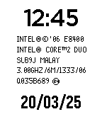
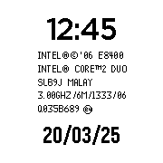

# Core 2 Duo watchface

this will be the default watchface for the upcoming core 2 duo watch by core devices (legit) source: trust me bro

 

## build instructions
Install [uv](https://t.co/SOfNPWPmJT) and run:

```
uv tool install pebble-tool
pebble sdk install latest
```
if you haven't already.

Clone the repo and build:

```
git clone https://github.com/nubbybubby/core2duo-watchface
cd core2duo-watchface
pebble build
```

the .pbw file will be in the build directory.
